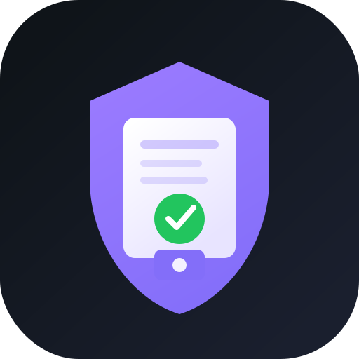

# CleanMandate

<p align="center">
  
</p>

**Verified payment mandates for AI agents** — Cleanverse Build hackathon entry (Track 02: Trusted AI Agent Transactions).

**Repos:** [Codeberg](https://codeberg.org/cubiczan/cleanmandate) · [GitHub](https://github.com/Cubiczan/cleanmandate)

CleanMandate composes your existing agent stack with [Cleanverse](https://cleanverse.com) compliance primitives on **Monad**:

| Layer | Role |
|-------|------|
| **A-Pass** | Wallet-bound principal identity |
| **CCP** | Pre-transaction rules + Travel Rule |
| **A-Token** | Compliant stablecoin transfer |
| **CHP** | Consensus Hardening Protocol lock gate |
| **Policy** | YAML spend controls (from `compliance-as-code-agent` patterns) |
| **Audit** | HMAC-signed `.cleanmandate/audit.jsonl` |

## Architecture

```
Principal (A-Pass) → Agent mandate JSON
    → cm-policy (allowlists, caps)
    → Cleanverse CCP (Travel Rule)
    → CHP gate (auto / human-in-the-loop)
    → A-Token transfer on Monad
    → Exportable compliance bundle
```

Integrates conceptually with:

- [`agent-conductor`](https://codeberg.org/cubiczan/agent-conductor) — MCP orchestration
- [`compliance-as-code-agent`](https://codeberg.org/cubiczan/compliance-as-code-agent) — policy packs
- [`consensus-hardening-protocol`](https://codeberg.org/cubiczan/consensus-hardening-protocol) — CHP locks
- [`swarmfi-executor`](https://codeberg.org/cubiczan/swarmfi-executor) — guarded execution patterns

## Quick start

```bash
cargo build --release -p cm-cli

# Mock mode (default) — offline demo, no API key
./target/release/cleanmandate pay \
  --mandate examples/mandates/vendor-payment.json \
  --dry-run

# Live sandbox (invitation code required from Cleanverse)
export CLEANVERSE_MODE=sandbox
export CLEANVERSE_API_KEY=your_key
export CLEANVERSE_API_BASE=https://sandbox.api.cleanverse.com/v3

./target/release/cleanmandate pay \
  --mandate examples/mandates/vendor-payment.json
```

## CLI

| Command | Description |
|---------|-------------|
| `cleanmandate pay --mandate <json>` | Full pipeline |
| `cleanmandate pay --dry-run` | Gates only, skip A-Token |
| `cleanmandate validate --mandate <json>` | Local policy check |
| `cleanmandate export --mandate-id <uuid>` | Audit bundle |
| `cleanmandate status` | Config + mode |

Environment:

- `CLEANVERSE_MODE` — `mock` (default) or `sandbox`
- `CLEANVERSE_API_KEY` — Bearer token for sandbox
- `CLEANVERSE_API_BASE` — API base URL
- `CLEANMANDATE_SIGNING_KEY` — HMAC key for audit ledger

## Hackathon demo script

1. Show mandate JSON (`examples/mandates/vendor-payment.json`) — agent requests $250 vendor payment.
2. Run `cleanmandate validate` — policy passes (allowlisted vendor, under cap).
3. Run `cleanmandate pay --dry-run` — A-Pass ✓, CCP ✓, CHP auto-lock ✓.
4. Bump amount to $6,000 in JSON — CHP returns `chp_review` (human approval).
5. Run live pay with sandbox credentials — A-Token tx hash on Monad testnet.
6. `cleanmandate export` — signed audit trail for regulators.

See [docs/CLEANVERSE_INTEGRATION.md](docs/CLEANVERSE_INTEGRATION.md) and [docs/DEMO.md](docs/DEMO.md).

## Crates

| Crate | Purpose |
|-------|---------|
| `cm-core` | Mandates, Travel Rule, audit ledger |
| `cm-policy` | YAML policy engine |
| `cm-cleanverse` | A-Pass / CCP / A-Token HTTP client |
| `cm-chp` | CHP approval gate |
| `cm-executor` | Orchestration pipeline |
| `cm-cli` | `cleanmandate` binary |

## License

MIT — Shyam Desigan / Cubiczan
